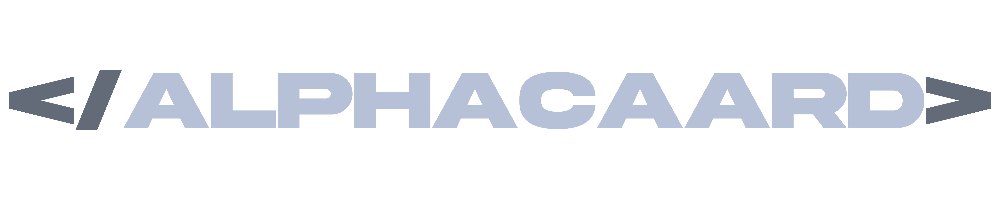

    
    

> **Alphacaard** é um **bot multi-funções** para **Discord** desenvolvido apenas para minha prática da linguagem **Python**.

---

## 📌 Funcionalidades

✅ Lista curta das principais funções do bot.  

- 🚀 Responde automaticamente a mensagens no Discord.  
- 🔄 Executa comandos personalizados.
- 🛠️ Moderação para seu servidor.  

## 👾 Tecnologias Utilizadas

- Linguagem: ``Python``  
- Biblioteca: ``discord.py``

## 📦 Adicione o bot no seu servidor

- > [**Clique aqui**](https://discord.com/oauth2/authorize?client_id=1329843971081637999) para adicionar.
- Caso tenha dúvidas, entre no [servidor de suporte](https://discord.gg/ZK7849p9Sd)

 
 

> **Alphacaard está em versão beta ainda, não ficará on-line 24 horas.**

---

    <a href="https://discord.gg/ZK7849p9Sd" target="_blank">
        
        
        
    <a href="https://livepix.gg/caard/apoiador" target="_blank">
        

